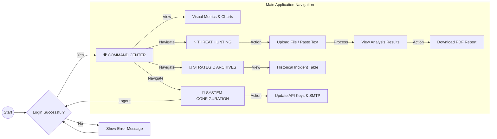

# ACSPM System Diagrams

Below are the structured diagrams representing the Architecture, Workflow, and User Interface flow for the **Autonomous Cloud Security Posture Management (ACSPM)** application.

## 1. High-Level System Architecture

This diagram illustrates the high-level components of the ACSPM system, showing how the Frontend (Streamlit) interacts with the Backend Logic (Python) and Data Layer (SQLite), as well as external integrations.

```mermaid
graph TD
    subgraph "Client Layer"
        User[Security Analyst]
        Browser[Web Browser]
    end

    subgraph "Application Layer (Streamlit)"
        Frontend[ACSPM Frontend Interface]
        Auth[Authentication Module]
        Logic[Logic Engine (utils.py)]
    end

    subgraph "Data Layer"
        DB[(SQLite Database)]
        Config[Configuration Files]
    end

    subgraph "External Services"
        AbuseIPDB[AbuseIPDB API (Threat Intel)]
        SMTP[SMTP Server (Email Alerts)]
    end

    User -->|Access| Browser
    Browser -->|HTTPS| Frontend
    Frontend -->|Login Request| Auth
    Auth -->|Validate Credentials| DB
    Frontend -->|Upload Logs| Logic
    Logic -->|Regex Extraction| Logic
    Logic -->|Query Reputation| AbuseIPDB
    Logic -->|Store Incident| DB
    Logic -->|Send Alert (If Critical)| SMTP
```

---

## 2. Sequence Flow Diagram (Incident Analysis Workflow)

This sequence diagram details the step-by-step flow of a typical investigation, from the user logging in to the system generating an alert. This is the most suitable diagram to understand the *dynamic* behavior of the system.

```mermaid
sequenceDiagram
    actor Analyst as Security Analyst
    participant App as ACSPM App (UI)
    participant Logic as Logic Engine
    participant API as AbuseIPDB API
    participant DB as SQLite Database
    participant Email as SMTP Server

    Analyst->>App: Login(Username, Password)
    App->>DB: Validate Credentials
    DB-->>App: Success/Failure
    
    rect rgb(20, 20, 30)
        Note over Analyst, App: Investigation Phase
        Analyst->>App: Upload Log File / Paste Text
        App->>Logic: Extract_Indicators(Raw Text)
        Logic-->>App: Return Extracted IPs, URLs, Emails
        
        loop For Each IP
            App->>Logic: Check_Threat_Intel(IP)
            Logic->>API: GET /check (IP, API Key)
            API-->>Logic: JSON Response (Risk Score)
            Logic-->>App: Return Threat Data
        end
    end

    rect rgb(40, 20, 20)
        Note over App, DB: Analysis & Response
        App->>Logic: Generate_Narrative(Threat Data)
        Logic-->>App: Returns AI Summary
        App->>DB: Save_Incident(JSON Data)
        
        alt Risk Level is CRITICAL
            App->>Logic: Generate_PDF_Report()
            Logic-->>App: PDF File Path
            App->>Logic: Send_Email_Alert(Report)
            Logic->>Email: Send SMTP Message
            Email-->>Logic: Success
            App-->>Analyst: Show "RED ALERT" Toast
        else Risk Level is LOW
            App-->>Analyst: Show "Green/Safe" Status
        end
    end
```



---

## 3. User Interface (UI) Flow Diagram

This diagram maps out the navigation structure of the application, showing how a user moves between different pages and states.


