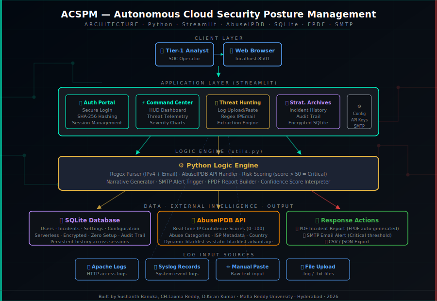
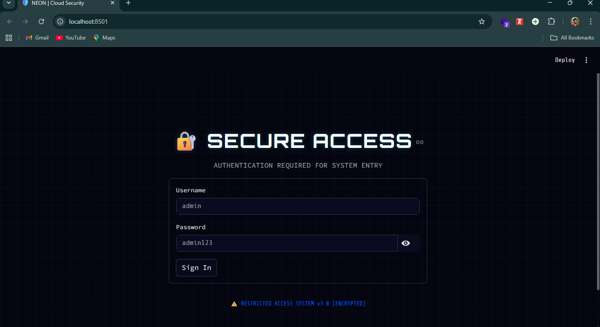
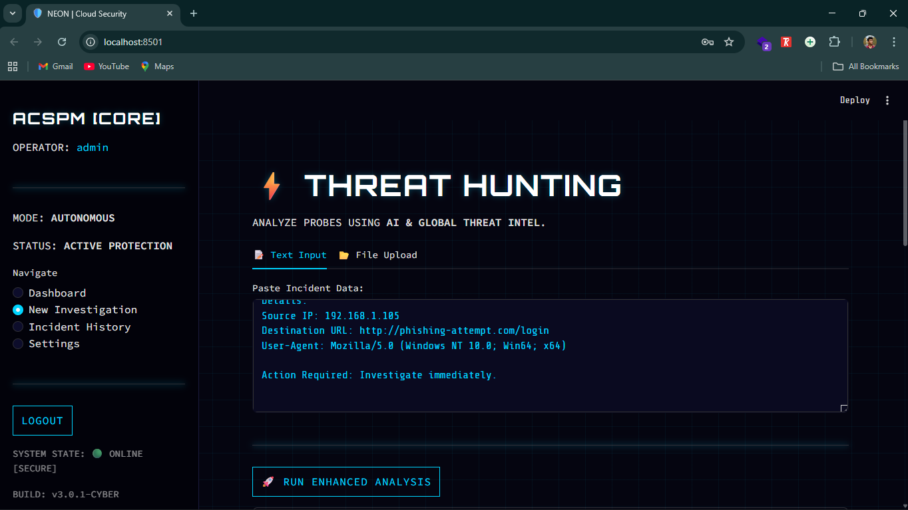
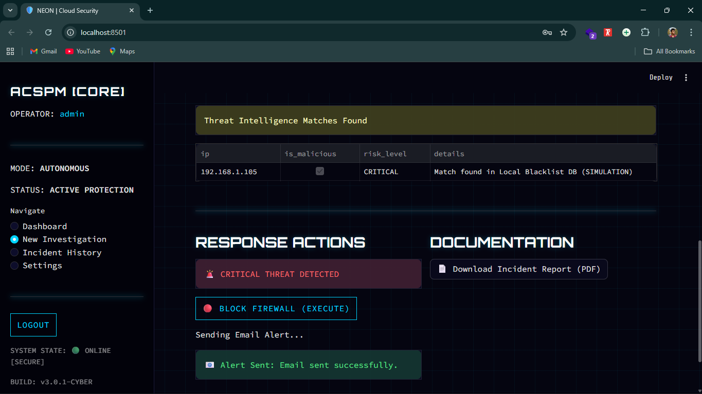
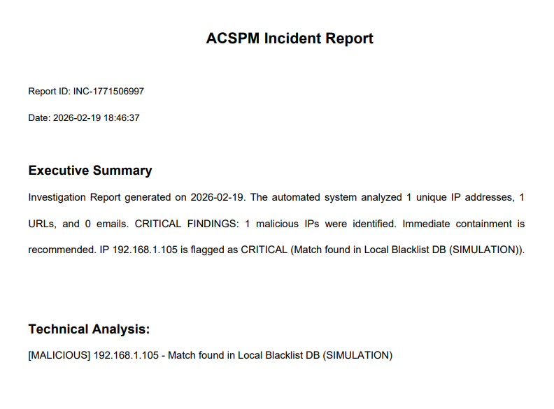
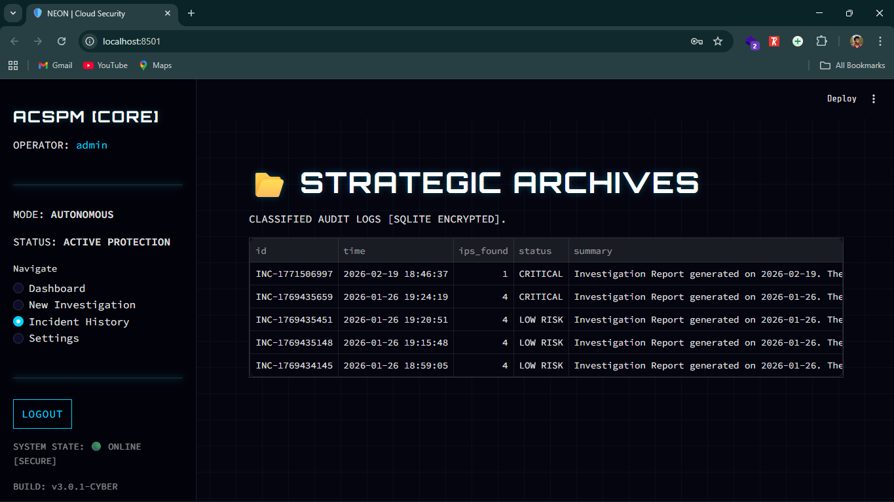

# ACSPM — Autonomous Cloud Security Posture Management 🛡️

# Project Description & Purpose

ACSPM is an automated, Python-based cloud security tool designed to eliminate the manual bottleneck in SOC (Security Operations Center) log analysis. Modern cyberattacks move faster than Tier-1 analysts can manually audit Apache and Syslog records — traditional workflows force analysts into a slow, error-prone "stare-and-compare" methodology that fails to scale as cloud architectures expand.

ACSPM addresses this by automating the ingestion of raw server log entries and immediately validating every extracted IP against **AbuseIPDB** — a global, real-time threat intelligence feed. This reduces the time to identify malicious IP behavior from hours to seconds. The platform provides a futuristic **Glassmorphism dark-mode HUD**, instant risk scoring, PDF/email alerting, and persistent audit history — all without requiring expensive enterprise SOAR tools.

This project is the technical implementation of the following published research paper and forms part of a broader Azure Cloud Security portfolio.


# Demo Video

*Watch the full walkthrough of the ACSPM Cloud Security HUD in action:*

[](https://youtu.be/edIdzt58nY0))


# Architecture Diagram



*System Flow: Tier-1 Analyst → Web Browser → Streamlit HUD (Auth Portal · Command Center · Threat Hunting · Strategic Archives) → Python Logic Engine (Regex Parser · Risk Scorer · AbuseIPDB Handler) → SQLite Database (persistent audit trail) + AbuseIPDB API (real-time threat intel) → PDF Incident Report + SMTP Email Alert + CSV/JSON Export*


# Dashboard Interface

**Figure 1 — Secure Access Portal**



*The entry point to ACSPM. "RESTRICTED ACCESS SYSTEM v3.0 [ENCRYPTED]". SHA-256 password hashing protects analyst credentials. The Glassmorphism dark-mode interface (Neon Cyan grid on Void Black) is designed to reduce screen glare during 24/7 security operations. Default credentials: `admin` / `admin123`.*


**Figure 2 — Threat Hunting Interface**



*The core analyst workspace. MODE: AUTONOMOUS · STATUS: ACTIVE PROTECTION. Analysts paste raw log data or upload .log/.txt files. ACSPM's regex engine instantly extracts all IPv4 addresses and email strings from heterogeneous server records. Each indicator is queued for real-time AbuseIPDB validation. BUILD: v3.0.1-CYBER.*


**Figure 3 — Threat Intelligence Analysis & Response Actions**



*After AbuseIPDB validation, the Threat Intelligence Matches table shows IP, malicious flag, risk level, and details. IP 192.168.1.105 is classified CRITICAL. Response Actions panel fires automatically: "CRITICAL THREAT DETECTED" banner, BLOCK FIREWALL (EXECUTE) command, and SMTP email alert — confirmed "Alert Sent: Email sent successfully."*


**Figure 4 — Automated PDF Incident Report**



*Auto-generated FPDF report on Critical detection. Report ID: INC-1771506997. Executive Summary: 1 malicious IP identified, immediate containment recommended. Technical Analysis: `[MALICIOUS] 192.168.1.105 - Match found in Local Blacklist DB (SIMULATION)`. Reports are downloadable directly from the DOCUMENTATION panel.*


**Figure 5 — Strategic Archives (Incident History)**



*CLASSIFIED AUDIT LOGS [SQLITE ENCRYPTED]. Persistent cross-session incident tracking across all investigations. Shows INC IDs, timestamps, IPs found, status (CRITICAL / LOW RISK), and full summary. Enables detection of slow-and-low attack patterns that evade single-session analysis.*


# Detected Threats & Impact

| Threat Type | Detection Method | Why It Matters | Response |
|---|---|---|---|
| Malicious IP Addresses | Regex IPv4 extraction + AbuseIPDB confidence score | Known malicious IPs executing credential stuffing, brute-force, C2 callbacks | PDF report + SMTP alert triggered automatically |
| Suspicious Email Addresses | Regex email extraction from log entries | Phishing source tracking, insider threat identification | Logged to incident database |
| High-Confidence Abuse (score > 50) | AbuseIPDB Confidence Score threshold | Identifies IPs with proven abuse history across global community data | Classified Critical — immediate alert |
| Medium-Risk Indicators (score 20–50) | AbuseIPDB partial match | Suspicious but unconfirmed threat sources | Classified High — flagged for analyst review |
| Slow-and-Low Probes | Persistent SQLite correlation across sessions | Distributed attacks that evade single-session detection | Historical trend analysis via Strategic Archives |
| Apache / Syslog Anomalies | Heterogeneous log parsing with preprocessing layer | Malformed headers and unusual request patterns | Regex preprocessing layer captures edge cases |


# Technologies Used

**Python:** Core automation engine for regex parsing, API integration, risk scoring logic, and report generation. Handles malformed server headers via a robust preprocessing layer.

**Streamlit:** Renders the interactive dark-mode Security HUD with Glassmorphism aesthetics (Neon Cyan + Void Black). Provides real-time dashboard updates, file upload interface, and multi-page navigation.

**AbuseIPDB API:** Real-time external threat intelligence feed providing dynamic Confidence Scores (0–100), abuse categories, ISP metadata, and country data. Chosen over static blacklists for its live, community-maintained data.

**SQLite3:** Serverless local database storing users, incidents, and settings. Zero setup required — supports encrypted audit trails and persistent cross-session incident correlation.

**Pandas:** Deep data manipulation, log filtering, anomaly table rendering, and fast CSV/JSON serialization for export.

**FPDF:** Auto-generates structured PDF Incident Reports on Critical detection events, including executive summary, technical analysis, and IP details.

**SMTP (smtplib):** Sends instant email alerts to the security team when risk level crosses Critical threshold. Validated to fire within sub-second response times.


# Installation & Usage

### 1. Prerequisites
Python 3.11+. AbuseIPDB free API key (register at [abuseipdb.com](https://www.abuseipdb.com)). Optional: Gmail SMTP credentials for email alerts.

### 2. Clone the Repository
```bash
git clone https://github.com/Sushanth-Banuka/acspm-cloud-security.git
cd acspm-cloud-security
```

### 3. Set Up the Virtual Environment

**Windows (PowerShell):**
```powershell
python -m venv venv
.\venv\Scripts\Activate.ps1
```

**macOS/Linux:**
```bash
python3 -m venv venv
source venv/bin/activate
```

### 4. Install Dependencies
```bash
pip install -r requirements.txt
```

### 5. Configure Credentials
Duplicate the `.env.template` file to `.env`:
```bash
cp .env.template .env
```

Fill in your credentials:
```env
# AbuseIPDB Threat Intelligence
ABUSEIPDB_API_KEY="your-abuseipdb-api-key"

# Azure Credentials (for cloud resource scanning)
AZURE_SUBSCRIPTION_ID="your-subscription-id"
AZURE_TENANT_ID="your-tenant-id"
AZURE_CLIENT_ID="your-client-id"
AZURE_CLIENT_SECRET="your-client-secret"

# SMTP Email Alerts (optional)
SMTP_EMAIL="your-gmail@gmail.com"
SMTP_PASSWORD="your-app-password"
SMTP_RECEIVER="receiver@email.com"
```

### 6. Launch the Security HUD
```bash
streamlit run dashboard/app.py
```

**Default Operator ID:** `admin`
**Default Passcode:** `cybersecurity`


# Key Security Concepts Demonstrated

- **Alert Fatigue Mitigation** — Automated log triage replaces manual "stare-and-compare" SOC methodology
- **Threat Intelligence Integration** — Real-time AbuseIPDB Confidence Scores replace static blacklists
- **Incident Response Automation** — Sub-second SMTP alerts and auto-generated PDF reports on Critical detection
- **Audit Trail Persistence** — SQLite cross-session correlation enables detection of slow-and-low attack patterns
- **Secure Credential Handling** — SHA-256 password hashing, environment variable API key storage
- **Graceful API Fallback** — System falls back to local simulation mode if AbuseIPDB is unreachable


# Academic Publication

This tool is the technical implementation of the following peer-reviewed research paper:

> **"Autonomous Cloud Security Posture Management (CSPM): An Event-Driven Framework for Real-Time Misconfiguration Remediation"**
> Mr. Sushanth Banuka
> Computer Science & Engineering — Cybersecurity, Malla Reddy University, Hyderabad, India — 2026
>
> *[Link to published paper — placeholder]*


*Disclaimer: This tool is for educational and authorized auditing purposes only. Ensure you have explicit permission to scan the target Azure environment and to process any log data through external APIs.*
